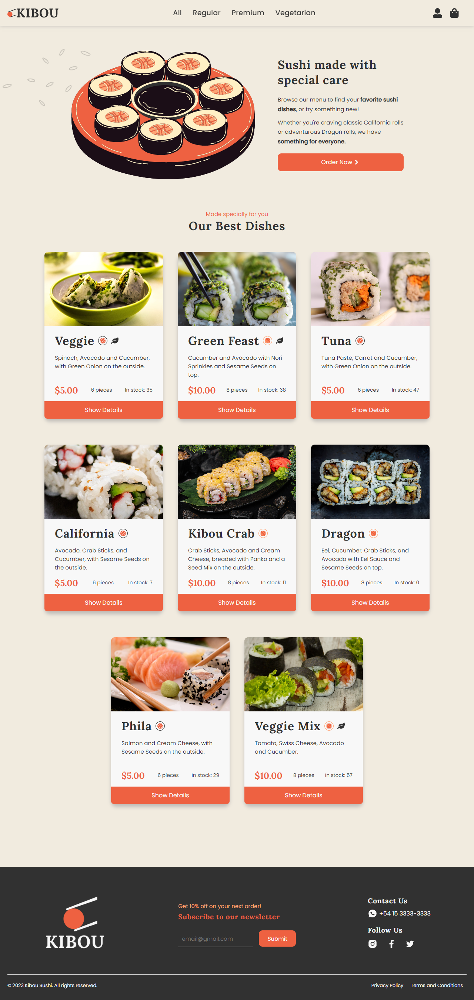

# Kibou Sushi - E-commerce Project for CoderHouse

This project was bootstrapped with [Create React App](https://github.com/facebook/create-react-app) for the ReactJS Course from [CoderHouse](https://www.coderhouse.com/).

## Table of contents

- [Overview](#overview)
  - [The task](#the-task)
  - [Screenshot & Navigation](#screenshot-&-navigation)
  - [Live Site](#live-site)
- [My process](#my-process)
  - [Built with](#built-with)
  - [What I learned](#what-i-learned)
- [Author](#author)
- [Acknowledgments](#acknowledgments)

## Overview

### The task

Users should be able to:

- View the optimal layout for the site depending on their device's screen size
- Log in, browse the products and go to their details.
- See the description, photo and price and put it into the cart from the product detail page.
- Display a compact listing of the order with the total price, once the cart has at least one product.
- Activate the 'checkout' button when they enter their first name, last name, telephone number and e-mail (entering it twice to check that it is correct).
- Click 'submit order' to save in the database an order with all the products, the date and give feedback on the order number.

### Screenshot & Navigation

[Demo Video](https://youtu.be/8iJcgJm8TrY)

### Live Site

- Live Site URL: [Kibou Sushi](https://kibou-sushi.vercel.app/)

## My process

### Built with

- Semantic HTML5 markup
- CSS custom properties
- Flexbox
- CSS Grid
- Mobile-first workflow
- [React](https://reactjs.org/)
- [React Icons](https://react-icons.github.io/react-icons) - To optimize the use of icons
- [Firebase](https://firebase.google.com/)

### What I learned

- Components
- Hooks (useState, useEffect)
- Routing and navigation with react-router-dom
- Events
- Context
- Rendering techniques
- Firebase

## Author

- Linkedin - [Valentina Belén Sánchez](https://www.linkedin.com/in/valentina-belen-sanchez/)
- Github - [ValentinaBS](https://github.com/ValentinaBS)

## Acknowledgments

I would like to thank my amazing teacher Cristina Gómez that was always willing to help when I got stuck with my code, and my tutor Agustin Ammazzagatti who gave me very good feedback throughout the course!